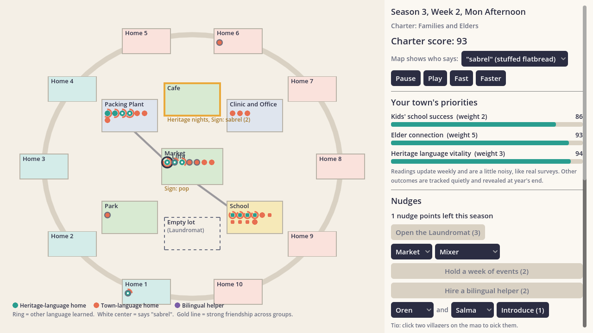
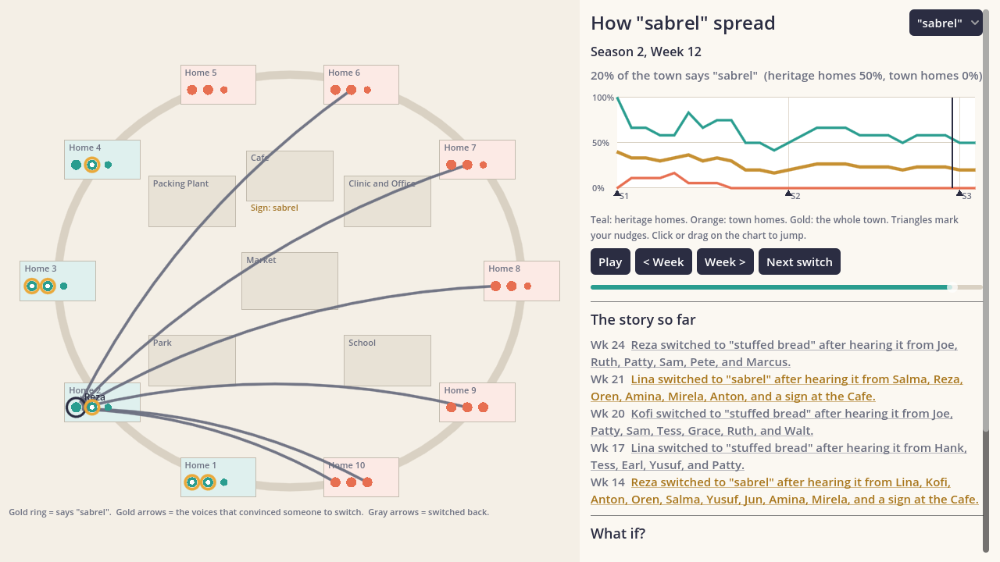

# Small Town

A complex-systems game about how language moves through a community.

**Developed by Julianne Hammink**



You are the town's community connector. Thirty neighbors live here: some speak the town language at home, and some speak a heritage language. You can't teach anyone or tell anyone what to do. You can only **nudge**: open a place where people meet, hold an event, introduce two people, hire a bilingual helper, or put up a sign. Words, habits, and friendships spread on their own.

At the start you write a **town charter**: you give points to the outcomes your town cares about (jobs, neighbor trust, kids' school success, elder connection, economic vitality, heritage-language vitality). Those outcomes show on your dashboard. Everything else is tracked quietly and revealed in the end-of-year report, so you see what your strategy cost.

## Status

Playable prototype (v0.3). One town, one year (4 seasons of 12 weeks), two languages, two competing word pairs, and a replay with "what if" at the end of the year.

## Running it

1. Install [Godot 4.4](https://godotengine.org/download) (standard version, not .NET).
2. Open Godot, choose **Import**, and select this folder's `project.godot`.
3. Press **F5** (Run Project).

### How to play

- **Pause / Play / Fast / Faster** control time. Each season gives you 4 nudge points.
- **Hover** over a dot to meet that villager and see their ties. **Click** two dots to pick them for an introduction.
- **Dots:** teal = heritage-language home, orange = town-language home, purple = bilingual helper. The colored ring around a dot shows how much of the *other* language that person has learned. A white center means they say "pop."
- **Gold lines** are strong friendships that cross language groups. Watch where they form.

| Nudge | Cost | What it does |
|---|---|---|
| Open the Cafe / Laundromat | 3 | A new shared space that pulls people in during free time |
| Week of events (Mixer) | 2 | Doubles conversations at a place and draws a crowd; mixing happens in the town language |
| Week of events (Heritage night) | 2 | Same crowd, but anyone who can follow speaks the heritage language |
| Bilingual helper | 2 | A helper who speaks both languages; learners seek them out, which wears them down |
| Introduction | 1 | Creates a tie between two people and has them meet at the park |
| Sign | 1 | A sign at a public place that counts as one more "voice" for a word |

## Two word pairs

Words spread through the same conversations as everything else, but each pair tells a different story.

| Item | Words | Starts | What can happen |
|---|---|---|---|
| Fizzy drink | "soda" vs "pop" (both town-language words) | Three committed speakers say "pop" | "Pop" is catchy, but it needs help. With a sign at the market it tips the whole town in about half of towns; without one, almost never. |
| Stuffed flatbread sold at the market | "stuffed bread" (town language) vs "sabrel" (heritage language) | Heritage homes say "sabrel"; town homes say "stuffed bread" | Two stable endings: the town **borrows** "sabrel" as a loanword, or heritage families **lose** it as kids and workers pick up "stuffed bread." With no nudges it's close to a coin flip. |

"Sabrel" is an invented word: the heritage language in the game is unnamed.

**Words follow the language being spoken.** When people speak the heritage language, anyone who speaks it well uses the heritage word. When they speak the town language, people use whichever word they prefer, which is how a loanword travels. So the heritage word's survival at home depends on whether families keep speaking the heritage language at home.

**Switching words** takes hearing a new word from more distinct people than you've heard your current word from (you count as one voice for your own word). Catchy words count for a bit more. Elders need one extra voice, and after switching, a person keeps the new word for at least four weeks.

Use the **"Map shows who says"** picker on the game screen to switch which word the map highlights. Hover over anyone to see both of their words.

What we found while tuning (24 towns each, details in `tests/word_census.gd`):

- A "sabrel" sign at the market in week 1 tips the town toward borrowing in 21 of 24 towns. The same sign in week 13 often does nothing: by then the town has settled. Early nudges matter most in a system with two stable endings.
- Heritage nights help heritage homes keep "sabrel" (77% still say it, compared with 67% with no nudges), but they spread it to the rest of town only a little, because people mostly talk with fellow speakers there.
- Mixer events speed up town-language learning but cost heritage homes their word.

## Replay and "what if"



After the year ends, **Replay the year** lets you scrub through time and watch a word move through town:

- **Pick a word** to trace ("pop" or "sabrel") with the picker in the top corner.
- **The map** shows everyone at home. A gold ring means they say the word. Arrows point from the voices that convinced someone to switch (people, or a sign) to the person who switched.
- **The chart** shows the share of the town using the word, week by week. For "sabrel" it also shows heritage homes (teal) and town homes (orange) separately. Triangles mark your nudges, and an orange dot marks the tipping point (the week it passed half the town). Click or drag on the chart to jump.
- **Next switch** steps to the next person who changed words and highlights their story. Click any line in "The story so far" to highlight that person.
- **What if?** Pick one of your nudges. The game replays the whole year from the same seed without it, then checks three more times with different luck. It only reports an effect as real if it shows up consistently; anything that changed in some runs but not others is labeled "probably just luck."

The luck check matters. In a complex system, a tiny change can send the year down a different path by chance, so a single replay can make a nudge look responsible for things it didn't cause.

## What's under the hood

The simulation is pure GDScript with no scene dependencies (`sim/`), so it runs headless and is deterministic: the same seed plus the same nudges give the same story. Each system (movement, conversation, sign-noticing, rewiring) has its own random stream, and every villager draws the same number of random values each day, so a nudge changes only what it actually touches. Removing a sign from a replay changes who says "pop" and nothing else; `tests/determinism_test.gd` checks this.

Each time slot (4 per day):

1. **Move:** villagers follow daily schedules (school, work, market, park, home), plus pulls toward shared spaces and events.
2. **Pair:** people at the same place pick partners, weighted by tie strength and **homophily** (preferring easy conversations).
3. **Talk:** they use the language they share best, with place norms and children's lean toward the town language. Success depends on shared proficiency; both people learn, more when the partner is stronger.
4. **Adopt:** **complex contagion.** A villager switches words only after hearing the new one from enough *different* sources (2, or 3 if shy, plus one for elders), and from more sources than their current word (counting themselves). Three "committed" speakers always say "pop."
5. **Decay:** unused languages fade slowly; unused ties weaken.
6. **Rewire (weekly):** the **adaptive network.** Some villagers drop a frustrating tie and keep an easy new one, so clusters harden unless you intervene.

Complex-systems features you can see in play: tipping points (one well-placed sign can flip the whole town's word), weak ties and brokers, homophily, path dependence, and delayed, noisy feedback (dashboard readings update weekly with a little survey noise).

## Project layout

```
autoload/game_session.gd   Current run, charter, and seed (shared between screens)
sim/                       The simulation (no scenes): state, scenario, systems, metrics
ui/                        Title, charter picker, game screen, end report, shared style
world/town_map.gd          Draws the town from the sim state
sim/replay.gd              Word-spread lookups, exact reruns, and the luck-checked "what if"
world/replay_map.gd        Draws the replay map and spread arrows
world/spread_chart.gd      Weekly spread chart with nudge markers and tipping point
tests/batch_run.gd         Headless tuning runs, writes tests/output/results.csv
tests/smoke_test.gd        Loads every screen and plays a full year
tests/determinism_test.gd  Checks reruns match exactly and nudges don't leak luck
tests/word_census.gd       Runs 24 towns and counts how each word pair ended
tests/screenshots.gd       Renders each screen to tests/output/*.png
docs/                      Design spec, Godot plan, and starting roster
```

## Testing and tuning

From this folder (replace `godot` with your Godot executable path):

```
godot --headless --script res://tests/smoke_test.gd
godot --headless --script res://tests/determinism_test.gd
godot --headless --script res://tests/word_census.gd -- nosign:1 sabrelsign:1
godot --headless --script res://tests/batch_run.gd -- --seeds=20
godot --headless --script res://tests/batch_run.gd -- --seeds=10 --only=mixers --set=gain:0.01,homophily:1.5
```

`batch_run.gd` simulates many towns under three scripted strategies (no nudges, mixers, heritage care) and prints the average of every metric at the end of each season. All tunable numbers live in `params` at the top of `sim/sim_state.gd`.

Averages over 20 seeds at the end of the year (0 to 1):

| Strategy | Job access | Heritage vitality | Segregation | Fragility | Says "pop" | "Sabrel" in heritage homes | "Sabrel" in town homes |
|---|---|---|---|---|---|---|---|
| No nudges | 0.95 | 0.80 | 0.41 | 0.46 | 0.15 | 0.64 | 0.35 |
| Mixers (with a "pop" sign) | 1.00 | 0.59 | 0.38 | 0.40 | 0.47 | 0.49 | 0.30 |
| Heritage care | 0.94 | 0.85 | 0.48 | 0.49 | 0.10 | 0.68 | 0.20 |

No single strategy wins every charter, which is the point.

## Changes from the design spec (v0.1)

The starter numbers in `docs/design-spec.md` were guesses. Batch testing led to these changes:

- **Learning gain 0.02 → 0.008.** At 0.02, heritage-language adults reached 0.60 in the town language in one season with no nudges, so jobs never felt at risk.
- **Switch rule:** a new word needs at least half as many distinct sources as the current word (`switch_ratio` 0.5). With "must outnumber," the new word could never spread, even with help.
- **Committed speakers:** the three "pop" seeds never switch back, a committed minority.
- **Children's lean toward the town language** (`child_prestige`), which is what makes heritage vitality fall as parents learn the town language.
- **Heritage night** event theme, so players have a lever that supports the heritage language.
- **Helpers** can hold up to 3 conversations per time slot, and learners seek them out; otherwise they never felt any strain.
- **Fragility** is now the share of cross-group contact carried by the top two bridge people (the network-split version always read 0 in a town this connected).
- **Signs are noticed 15% of the time** per visit (`sign_notice`). When every passerby read every sign, one sign flipped the whole town in under a week.
- **Switching words (v0.3):** the bar is now "more voices than your current word, counting yourself," with a four-week habit after each switch. The v0.2 rule let people flip back and forth almost daily (hundreds of switches a year); now it's a few dozen. "Pop" got an appeal of 1.4 so a sign can still tip it.
- **Heritage nights** draw mostly heritage-language speakers, plus a few curious neighbors. When they drew everyone equally, they pulled heritage families out of their homes and actually hurt the heritage word.
- **Events start the next day** and run for a week, so buying one never reshuffles anyone's plans for today.
- **Town news** reports word milestones (a quarter, half, three quarters of the town) instead of every switch; the replay holds the full story.

## Not built yet

From `docs/godot-plan.md`: a third language, saving scenarios as `.tres` resources, and sound. Words don't count toward the charter score yet; a "keep the heritage word" charter goal would be a natural addition.
